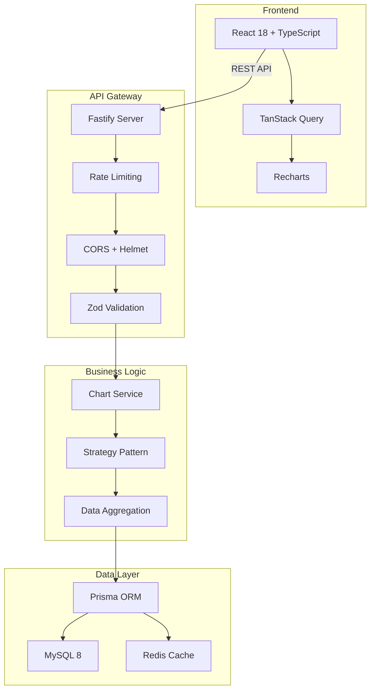

# 📊 Dynamic Dashboard - Enterprise Grade Solution

<div align="center">

[](https://www.typescriptlang.org/)
[](https://nodejs.org/)
[](https://react.dev/)
[](https://www.fastify.io/)
[](https://www.prisma.io/)
[](https://www.mysql.com/)

[]()
[]()
[]()

</div>

## 🚀 Overview

A production-ready financial dashboard with dynamic REST API backend and modern React frontend, featuring real-time data visualization, infinite scroll capabilities, and enterprise-grade architecture.

### ✨ Key Features

- **Dynamic Chart Engine**: Single API endpoint that adapts to any chart type
- **Smart Caching**: Redis + ETag-based HTTP caching for sub-200ms responses
- **Real Infinite Scroll**: Cursor-based pagination with intersection observer
- **Type Safety End-to-End**: Shared types between frontend and backend
- **Production Ready**: Health checks, graceful shutdown, structured logging
- **High Performance**: Optimized queries, connection pooling, React memoization

## 🏗️ Architecture



## 📋 Prerequisites

- **Node.js** >= 20.0.0 (LTS)
- **pnpm** >= 8.0.0
- **Docker** & Docker Compose
- **MySQL** 8.x (via Docker)
- **Redis** 7.x (via Docker)

## 🛠️ Installation

### 1. Clone the repository

```bash
git clone <repository-url>
cd dashboard-project
```

### 2. Install dependencies

```bash
# Install pnpm if not already installed
npm install -g pnpm@8

# Install all dependencies
pnpm install
```

### 3. Environment setup

```bash
# Copy environment example
cp .env.example .env

# Edit .env with your configuration
nano .env
```

### 4. Database setup

```bash
# Start MySQL and Redis containers
pnpm run db:up

# Wait for services to be ready
docker-compose ps

# Run database migrations
pnpm run db:migrate

# Seed database with sample data
pnpm run db:seed
```

### 5. Start development servers

```bash
# Start both API and Web in parallel
pnpm run dev

# Or start individually
pnpm run dev:api  # API on http://localhost:3000
pnpm run dev:web  # Web on http://localhost:5173
```

## 📁 Project Structure

```
.
├── apps/
│   ├── api/                 # Backend application
│   │   ├── src/
│   │   │   ├── controllers/ # Route handlers
│   │   │   ├── services/    # Business logic
│   │   │   ├── middleware/  # Custom middleware
│   │   │   └── utils/       # Helper functions
│   │   ├── prisma/          # Database schema & migrations
│   │   └── tests/           # API tests
│   └── web/                 # Frontend application
│       ├── src/
│       │   ├── components/  # React components
│       │   ├── pages/       # Page components
│       │   ├── hooks/       # Custom hooks
│       │   └── services/    # API clients
│       └── tests/           # Frontend tests
├── packages/
│   ├── shared/              # Shared utilities
│   └── types/               # Shared TypeScript types
├── docs/                    # Documentation
├── scripts/                 # Build & deployment scripts
└── docker-compose.yml       # Local development environment
```

## 🧪 Testing

```bash
# Run all tests
pnpm test

# Unit tests only
pnpm run test:unit

# Integration tests
pnpm run test:integration

# E2E tests
pnpm run test:e2e

# Coverage report
pnpm run test:coverage

# Watch mode
pnpm run test:watch
```

## 📊 API Documentation

### Base URL
```
http://localhost:3000/api/v1
```

### Available Endpoints

#### Dynamic Charts
```http
GET /charts/:type
```

| Parameter | Type | Required | Description |
|-----------|------|----------|-------------|
| `type` | `line\|bar\|pie\|table\|kpi` | Yes | Chart type |
| `start` | ISO 8601 | Yes | Start date |
| `end` | ISO 8601 | Yes | End date |
| `metric` | `revenue\|expense\|profit` | No | Metric to display |
| `groupBy` | `day\|week\|month` | No | Grouping period |

#### Options with Infinite Scroll
```http
GET /options/:entity
```

| Parameter | Type | Required | Description |
|-----------|------|----------|-------------|
| `entity` | string | Yes | Entity type |
| `cursor` | string | No | Pagination cursor |
| `search` | string | No | Search query |
| `limit` | number | No | Items per page |

### Swagger UI

Access interactive API documentation at:
```
http://localhost:3000/api/docs
```

## 🚀 Production Build

```bash
# Build all applications
pnpm run build

# Build specific app
pnpm run build:api
pnpm run build:web

# Start production servers
NODE_ENV=production pnpm start
```

## 🐳 Docker Deployment

```bash
# Build images
docker build -f apps/api/Dockerfile -t dashboard-api .
docker build -f apps/web/Dockerfile -t dashboard-web .

# Run with docker-compose
docker-compose -f docker-compose.prod.yml up
```

## 📈 Performance Metrics

- **API Response Time**: < 200ms (p95)
- **Database Query Time**: < 50ms (p95)
- **Frontend Bundle Size**: < 200KB (gzipped)
- **Time to Interactive**: < 2s
- **Lighthouse Score**: 95+

## 🔒 Security Features

- Input validation with Zod
- SQL injection prevention (Prisma)
- XSS protection (React + CSP headers)
- Rate limiting (100 req/min)
- CORS configuration
- Helmet.js security headers
- Environment variable management

## 📝 Scripts Reference

| Script | Description |
|--------|-------------|
| `pnpm dev` | Start development servers |
| `pnpm build` | Build all applications |
| `pnpm test` | Run all tests |
| `pnpm lint` | Run ESLint |
| `pnpm format` | Format with Prettier |
| `pnpm typecheck` | TypeScript type checking |
| `pnpm db:migrate` | Run database migrations |
| `pnpm db:seed` | Seed database |
| `pnpm db:studio` | Open Prisma Studio |

## 🛠️ Development Tools

- **Database UI**: PhpMyAdmin at http://localhost:8080
- **Redis UI**: Redis Commander at http://localhost:8081
- **API Docs**: Swagger UI at http://localhost:3000/api/docs
- **Prisma Studio**: Run `pnpm db:studio`

## 🤝 Contributing

1. Create a feature branch (`git checkout -b feature/amazing-feature`)
2. Commit your changes (`git commit -m 'feat: add amazing feature'`)
3. Push to the branch (`git push origin feature/amazing-feature`)
4. Open a Pull Request

### Commit Convention

We follow [Conventional Commits](https://www.conventionalcommits.org/):

- `feat:` New feature
- `fix:` Bug fix
- `docs:` Documentation
- `style:` Code style
- `refactor:` Code refactoring
- `perf:` Performance improvement
- `test:` Testing
- `chore:` Maintenance

## 📄 License

This project is licensed under the MIT License.

## 🙏 Acknowledgments

Built with excellence for the Tech Lead position evaluation.

---

<div align="center">

**Built with ❤️ using modern technologies**

[Report Bug](https://github.com/user/repo/issues) · [Request Feature](https://github.com/user/repo/issues)

</div>
